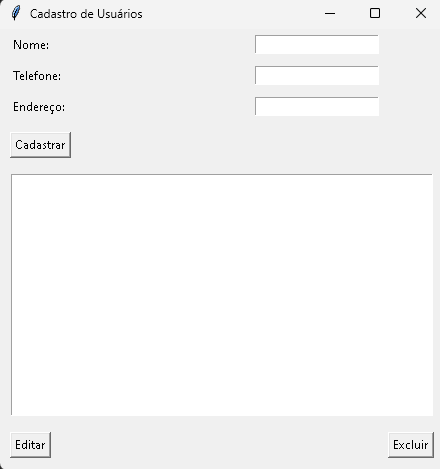
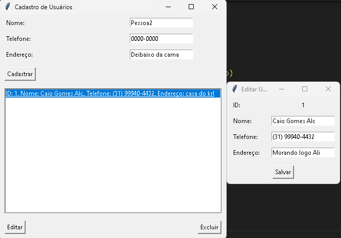

# Cadastro de Usuário #
Este é o repositório de um projeto autoral no qual o objetivo é realizar o cadastro de Usuários em uma base de dados, a mesma irá solicitar nome, telefone e endereço, também é possível editar o cadastro de usuário ja feito e excluir o mesmo. Feito por Caio Gomes. 

  

- **Modo de usar**: Digite as informações do usuário a ser criado nos campos destinados, clique em cadastrar, após isso você pode ver seu usuário criado com os dados, tente editar o mesmo ou excluí-lo.

  

